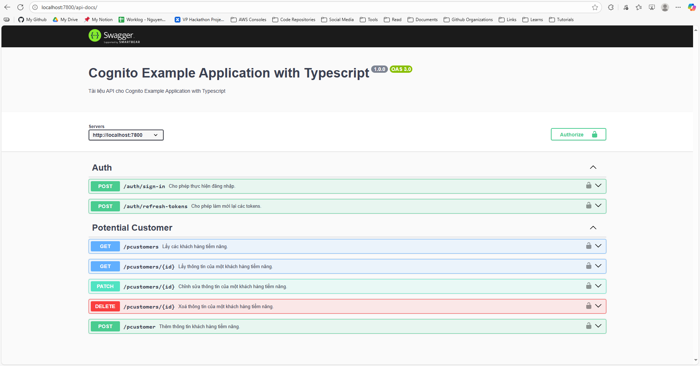

# Cognito Example Projects (Application)

> Author: Nguyen Anh Tuan
> From: DNTU - First Cloud Journey
> Contant: nguyenanhtuan19122002@gmail.com

<p align="center"></p>

---

## About

Xin chào, đây là repo chứa các mã nguồn của ứng dụng được sử dụng trong bài workshop cognito, các bạn có thể xem bài workshop đó [tại đây](https://fcj-dntu.github.io/cognito-workshop/). Các bạn có thể lấy mã nguồn trong này mà triển khai thẳng hoặc là làm theo bài workshop

---

## Introduction

Trong phần mã nguồn này thì mình sẽ dùng 3 ngôn ngữ khác nhau để triển khai ứng dụng trong bài workshop, bao gồm: Typescript (Javascript) và Python, nhằm để nhấn mạnh tính khả thi cũng như là khả năng triển khai Authentication & Authorization với nhiều ngôn ngữ khác nhau của chiến lược mà mình đưa ra, với sự hỗ trợ từ AWS SDK. Thế nên, để có thể thực hành được bài này thì các bạn nên biết cơ bản về lập trình, cấu hình mã nguồn cũng như là thao tác với CLI.

> Note: các bạn có thể thoải mái dùng cấu trúc & kiến trúc mã nguồn, ứng dụng trong bài này để triển khai thành dự án của riêng các bạn.

## Project Structure

Tuy là các ngôn ngữ khác nhau, môi trường phát triển khác nhau, nhưng nhìn chung thì mình sẽ phát triển cấu trúc mã nguồn của từng ngôn ngữ giống nhau nhất có thể, từ một tư duy trừu tượng chung nhất có thể để đảm bảo được tính nhất quán cho mỗi dự án.

```
.
├── src/
│   ├── core/
│   │   ├── context/
│   │   ├── error/
│   │   │   ├── AppError
│   │   │   └── ClientError
│   │   ├── modules/
│   │   │   ├── auth/
│   │   │   └── pcustomer-management/
│   │   └── adapters/
│   ├── runtimes/
│   │   ├── fastapi/
│   │   ├── express/
│   │   └── lambda_functions/
│   │       ├── authorizer/
│   │       └── pcustomer-management/
│   └── utils/
│       ├── configs/
│       ├── constants/
│       └── logger.*
└── test/
```

Giải thích:

- `core`: toàn bộ thành phần quan trọng nhất của mã nguồn nó sẽ nằm ở đây, là cái lõi bên trong một một ứng dụng backend. Trong `core` thì chúng ta sẽ chú ý thêm một số thư mục sau:
  - `context`: để có thể chuẩn hoá được input và output cho mỗi thành phần, một một module ở trong mã nguồn, thì chúng ta sẽ cần phải có một hoặc nhiều context cho các thành phần, modules đó. Context có thể được hiểu đơn giản như là utils của core là một bộ các công cụ, có thể giúp cho các hàm, các modules có thể lấy được thứ mà nó muốn để thực hiện công việc.
  - `error`: lỗi là thứ không thể thiếu trong mọi loại phần mềm, trong này thì mình sẽ chia làm 2 loại lỗi: `AppError` là toàn bộ lỗi trong ứng dụng backend, nó được tạo ra khi muốn thông báo lỗi về cho Client, theo ngữ cảnh của HTTP thì mã lỗi của nó là các mã lỗi 50x; `ClientError` được hiểu theo 2 nghĩa: 1. là lỗi từ Client App mà backend phát hiện ra, theo ngữ cảnh của HTTP thì mã lỗi của nó sẽ là các mã lỗi 40x. 2. là lỗi từ một function, module nào đó mà function hoặc module hiện tại phát hiện ra.
  - `moduels`: là nơi chứa các mã nguồn gốc như là usecase, dao, repository, validator, ... Cái này thì mình sẽ không giải thích nhiều.
- `runtimes`: để có thể triển khai được `core` (chạy được phần `core`), thì mình sẽ cần phải định nghĩa được environment và runtime đặc thù cho từng ngôn ngữ khác nhau, trong này thì mình ví dụ một số env & runtime như là **springboot**, **fastapi** và **express**.
- `utils`: các đoạn mã có tính tái sử dụng cao, chuyên dùng để nhúng vào mọi nơi trong mã nguồn thì sẽ nằm ở đây. Tưởng tượng như trong project mình sẽ cần phải xử lý chuỗi cơ bản, nhưng phải tốn rất nhiều dòng code, nhưng giờ mình muốn áp dụng xử lý chuỗi đó ở nhiều nơi khác nhau => đó chính là mục đích sử dụng của `utils`.
- `test`: nếu như muốn test một hàm, một module hoặc tích hợp nhiều hàm và nhiều modules, thì chúng ta sẽ viết các kịch bản, cases ở trong này. Đơn giản chỉ có thể thôi !!
- Ngoài ra thì mỗi mã nguồn dự án sẽ có nhiều file cấu hình riêng biệt.

> Note: với các file mà được đặt tên theo PascalCase thì có nghĩa file đó chứa lớp đối tượng.

Mỗi một thành phần sẽ có các cách tiếp cận, tư duy xây dựng mã khác nhau, nhưng sau cùng thì chúng ta sẽ hướng về một mục tiêu duy nhất: triển khai thành công Authentication & Authorization trên ứng dụng mẫu với Cognito.

---

## Conclusion

Trong mỗi thư mục `typescript` và `python`thì các bạn sẽ được giới thiệu qua thêm về mã nguồn ở trong đó cũng như là cách setup cơ bản. Nếu như cần chi tiết thì hãy coi qua bài workshop. 
